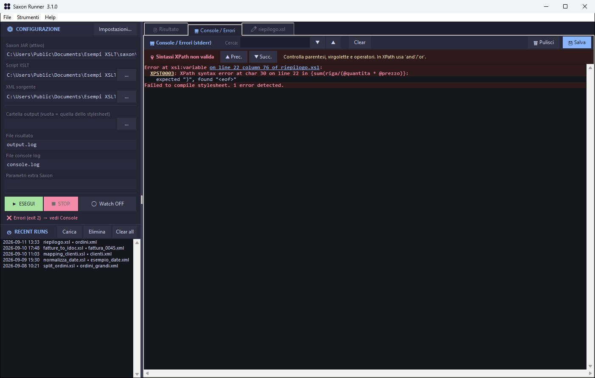

# Saxon Runner

Interfaccia grafica per [Saxon](https://www.saxonica.com/) su Windows. Scegli lo stylesheet XSLT e il file XML, premi **Esegui**: il risultato e gli errori di Saxon arrivano in due schede separate, e un clic su un errore apre lo stylesheet alla riga giusta.



## Scarica

- **[Installer per Windows](https://github.com/bdbais/saxon-runner/releases/latest/download/SaxonRunner-Setup.exe)**, consigliato: si aggiorna da solo e si disinstalla da *App installate*.
- [Versione portatile](https://github.com/bdbais/saxon-runner/releases/latest/download/SaxonRunner-portable.exe): un solo file, niente installazione; avvisa quando esce una versione nuova.

Servono Java e un JAR di Saxon (HE è gratuito). Il **[manuale utente](docs/MANUALE.md)** spiega installazione, primo avvio e tutte le funzioni. L'exe non è firmato: la prima volta SmartScreen chiede conferma (*Ulteriori informazioni ▸ Esegui comunque*). Ogni release pubblica gli SHA-256 in `SHA256SUMS.txt`.

## Cosa fa

- Esegue Saxon HE, PE o EE (più JAR configurabili) con parametri, output e log su file.
- Colora la console di Saxon, spiega in italiano i codici d'errore più comuni e rende cliccabili le posizioni `on line N of file.xsl`.
- Editor XSLT con evidenziazione della sintassi, trova e sostituisci, righe d'errore segnate. Salva nella codifica originale del file.
- **Watch**: rilancia la trasformazione ogni volta che salvi lo stylesheet o l'XML.
- Esecuzioni recenti e configurazioni salvabili in file `.saxcfg`.
- Assistente AI **locale**, facoltativo, con [Ollama](https://ollama.com) o LM Studio: autocompletamento, controllo dello stylesheet, chat.
- Aggiornamento automatico con verifica del checksum.

## Privacy

Nessuna telemetria e nessun account. Le uniche connessioni sono il controllo degli aggiornamenti (legge da GitHub il numero dell'ultima versione; si disattiva nelle impostazioni) e, se lo attivi, l'assistente AI verso l'endpoint che indichi tu, di default Ollama su `localhost`.

## Dai sorgenti

Python 3.10 o successivo, solo libreria standard.

```
pythonw SaxonRunner.pyw
python -m unittest discover -s tests -v
.\build.ps1          # exe con PyInstaller e, se c'è Inno Setup 6, installer
```

| File | |
|---|---|
| `saxon_runner.py` | Il programma |
| `updater.py` | Controllo, download e verifica degli aggiornamenti |
| `SaxonRunner.pyw` | Avvio senza console e punto d'ingresso di PyInstaller |
| `SaxonRunner.spec` | Build dell'exe |
| `installer/SaxonRunner.iss` | Installer e disinstallazione (Inno Setup 6) |
| `site/` | La pagina di [saxonrunner.bais.info](https://saxonrunner.bais.info/): Worker Cloudflare, si pubblica con `npx wrangler deploy` da quella cartella |
| `.github/workflows/release.yml` | CI: test, exe, installer, prova di installazione, release |
| `docs/MANUALE.md` | Manuale utente |
| `docs/CODE_REVIEW.md` | Revisione della 3.0 e correzioni della 3.1 |

### Pubblicare una versione

1. Aggiorna `__version__` in `saxon_runner.py` e aggiungi la sezione in `CHANGELOG.md`.
2. `git tag v3.2.0 && git push origin main --tags`.

La CI compila, avvia l'exe in modalità di prova, crea l'installer, lo installa e lo disinstalla, poi pubblica la release con le note prese dal changelog. Le copie installate la propongono al successivo avvio.

## Sostieni il progetto

Saxon Runner è gratuito e open source, e lo resterà. Se ti fa risparmiare tempo e ti va, puoi offrire un caffè a chi lo mantiene: **[paypal.me/bellizia](https://paypal.me/bellizia)**. Nessun obbligo, il programma funziona identico in ogni caso.

## Contributori

- **bdbais** — ideazione, sviluppo, uso sul campo
- **Claude Opus 5** — code review e versione 3.1

## Licenza

[Apache License 2.0](LICENSE). Saxon è un prodotto di Saxonica Ltd, con una licenza propria, e non è incluso in questo progetto. Saxon Runner non è affiliato con Saxonica.
